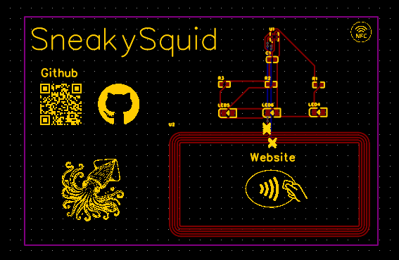
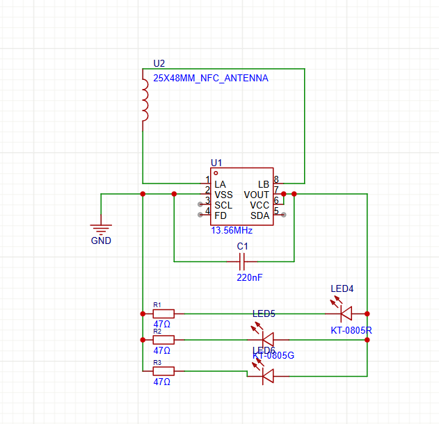

# Total time: ~5 hours
# July 7th
I decided to make this project before going to undercity to make it easier to share my projects with people. I decided to use easyEDA as oppose to kicad for this project so that i can get PCB assembly through JLCPCB as I wouldn't be able to hand solder the nfc component. After playing around with EasyEDA for a while I found the hackcard tutorial by hack club: https://jams.hackclub.com/jam/hacker-card which i followed to create Squid Card. I added more LEDs of different colours in parallel to create an RGB strip and converted this into a pcb. After experimenting with some different designs, I opted for a minamilistic look with just a link to the github and website, which contains more information. I also researched into different bussiness card sizing standards. Initially I placed some components inside the antenna but then realised that this would make it difficult to avoid shortcircuits and amy intefere with the nfc. I added silkscreen designs and started over a few times until I had an arrangement of the components and silkscreen that I liked and opted for a blue colour to mimic the ocean as the card is squid themed.
  

